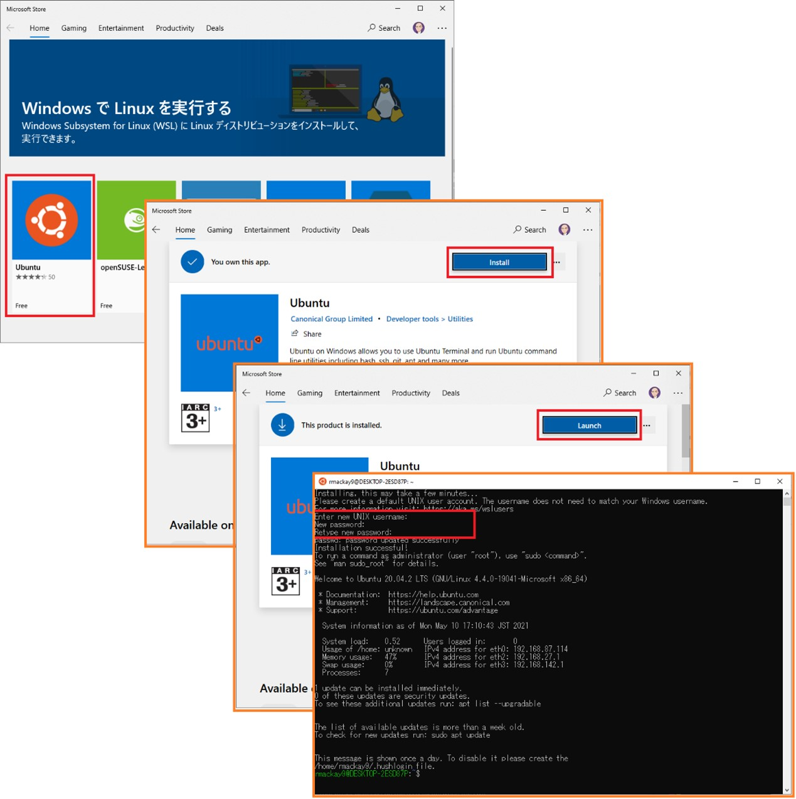
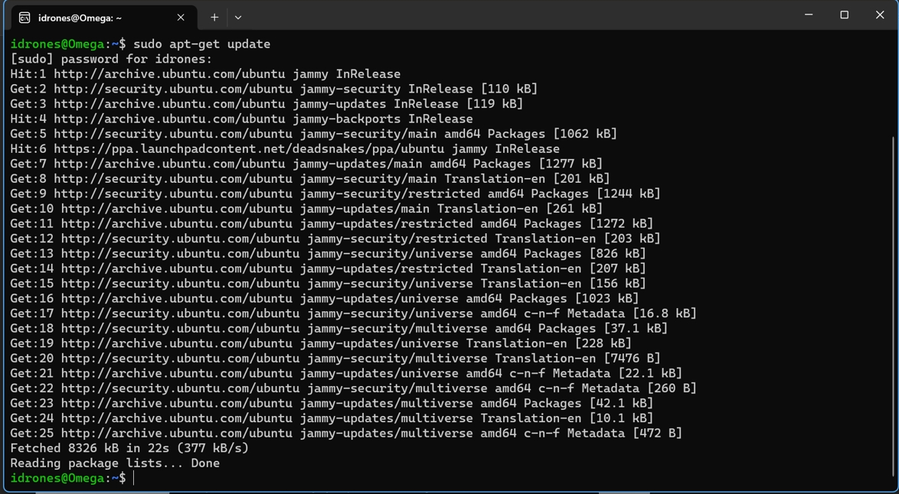
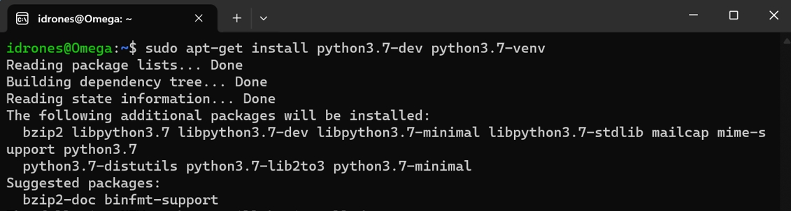
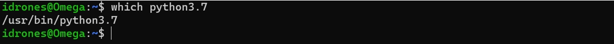
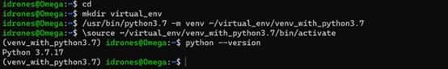
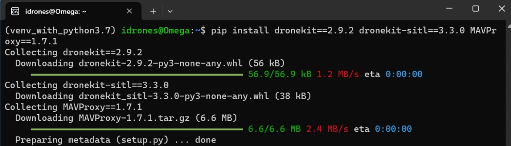
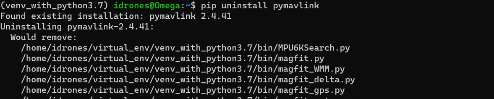
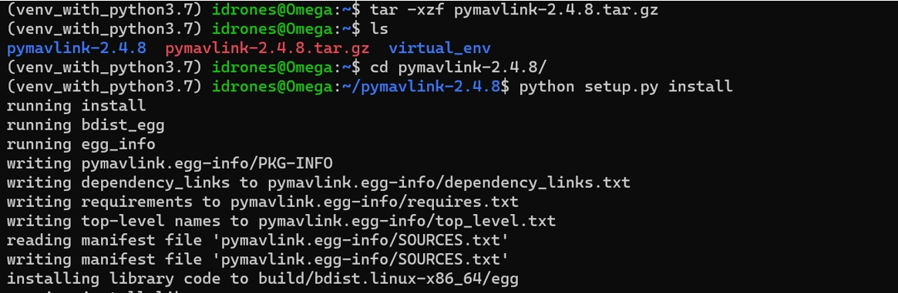
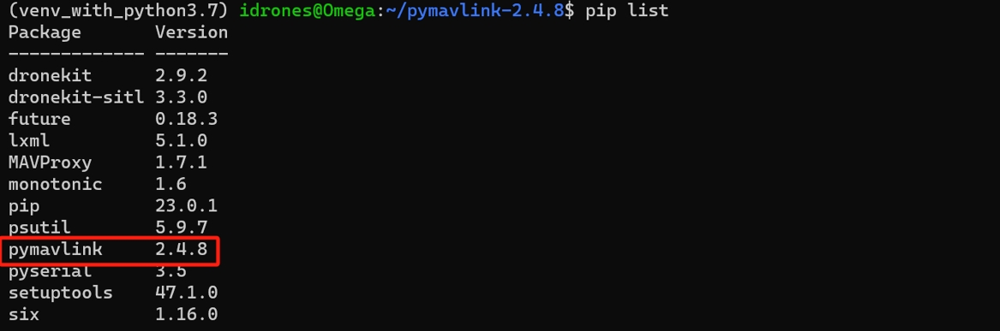

# Software in the Loop (SITL)

The SITL (software in the loop) simulator allows you to run Plane, Copter or Rover without any hardware. It is a build of the autopilot code using an ordinary C++ compiler, giving you a native executable that allows you to test the behaviour of the code without hardware.

## Installation
1. MissionPlanner (MP) is a software application used in the field of unmanned aerial vehicles (UAVs) and drones. It is a ground control station (GCS) that provides a user interface for planning, monitoring, and controlling missions for various types of drones. MissionPlanner is commonly associated with the ArduPilot open-source autopilot platform. [Download address](https://ardupilot.org/planner/docs/mission-planner-installation.html)

   Notes: You should install all drivers during the installation. And run the MP without enable other features at startup.

2. Open the Microsoft store to allow installing Ubuntu. Then Launch Ubuntu and fill in a username and login. The user name and password is recommended to be the same as the ID of your computer, e. g. CAE1.


3. Ubuntu instructions to install SITL development environment. Please enter the following command at the command line:
```
sudo apt-get update
```
```
sudo apt-get install git
```
```
sudo apt-get install gitk git-gui
```
```
sudo apt install software-properties-common
```
```
sudo add-apt-repository ppa:deadsnakes/ppa
```
```
sudo apt install python3-dev gcc
```
```
sudo apt update
```


4. Install python 3.7 and its’ virtual environment package.
```
sudo apt-get install python3.7-dev python3.7-venv
```
```
which python3.7 
```
The output should be something like /usr/bin/python3.7



5. Create Virtual Environment and enter it.
```
mkdir virtual_env 
```   
```
/usr/bin/python3.7 -m venv ~/virtual_env/venv_with_python3.7 
```
```
\source ~/virtual_env/venv_with_python3.7/bin/activate 
```
```
python --version 
```


6. Install SITL required packages in Python3.7 virtual environment.
```
pip install dronekit==2.9.2 dronekit-sitl==3.3.0 MAVProxy==1.7.1 
```
```
git clone https://github.com/dronekit/dronekit-python.git
```
```
pip uninstall pymavlink 
```
```
wget https://mirrors.aliyun.com/pypi/packages/cd/6a/3a068f16c5549e500a9cdeae738b5a92214174446e5a5ad9d1f6bd51a98b/pymavlink-2.4.8.tar.gz#sha256=b39749d9c75117c03cca8e0ac670d2f5a1fcff89f1567a398b29d0f198c95fb6 
```
```
tar -xzf pymavlink-2.4.8.tar.gz 
```
```
cd pymavlink-2.4.8/ 
```
```
python setup.py install 
```




7. You can check if all the packages version is correct with the example below:


8. Create a folder named SITL in the root directory of your C drive, then download all the files from Github and save them to the SITL folder.


```
@inproceedings{song2020flightmare,
    title={Flightmare: A Flexible Quadrotor Simulator},
    author={Song, Yunlong and Naji, Selim and Kaufmann, Elia and Loquercio, Antonio and Scaramuzza, Davide},
    booktitle={Conference on Robot Learning},
    year={2020}
}
```

## License
This project is released under the MIT License. Please review the [License file](LICENSE) for more details.
