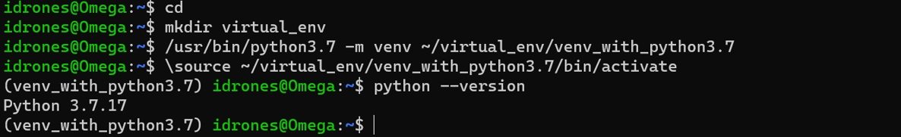
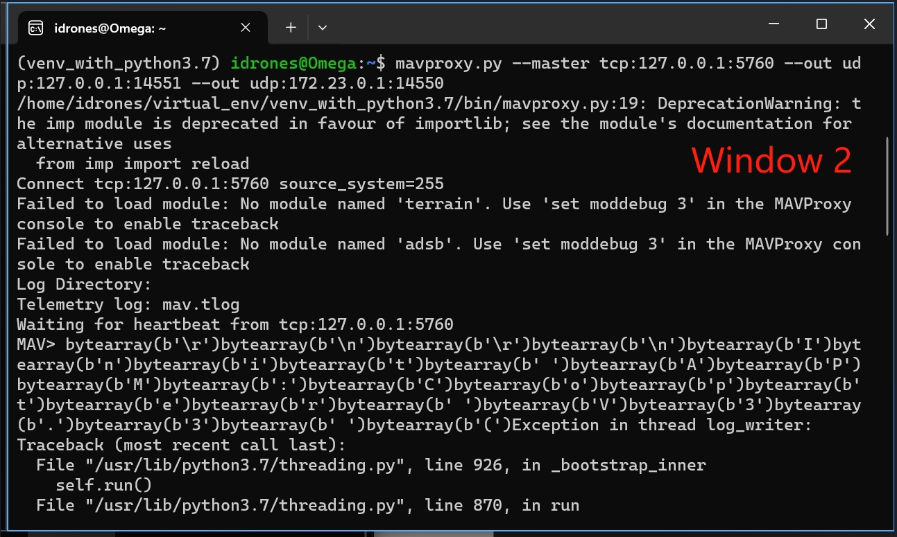
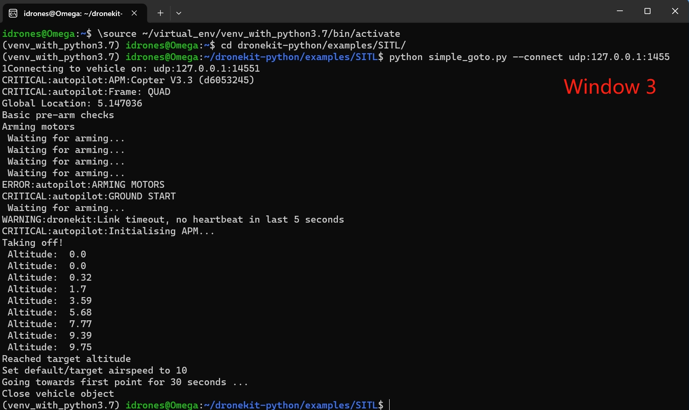
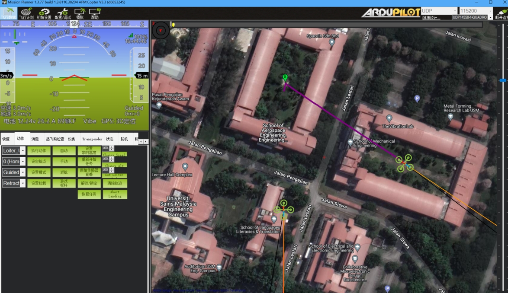

# Software in the Loop (SITL)

The SITL (software in the loop) simulator allows you to run Plane, Copter or Rover without any hardware. It is a build of the autopilot code using an ordinary C++ compiler, giving you a native executable that allows you to test the behaviour of the code without hardware.

## Installation
1. MissionPlanner (MP) is a software application used in the field of unmanned aerial vehicles (UAVs) and drones. It is a ground control station (GCS) that provides a user interface for planning, monitoring, and controlling missions for various types of drones. MissionPlanner is commonly associated with the ArduPilot open-source autopilot platform. [Download address](https://ardupilot.org/planner/docs/mission-planner-installation.html)

   Notes: You should install all drivers during the installation. And run the MP without enable other features at startup.

2. Open the Microsoft store to allow installing Ubuntu. Then Launch Ubuntu and fill in a username and login. The user name and password is recommended to be the same as the ID of your computer, e. g. CAE1.


3. Ubuntu instructions to install SITL development environment. Please enter the following command at the command line:
   ```
   sudo apt-get update
   ```
   ```
   sudo apt-get install git
   ```
   ```
   sudo apt-get install gitk git-gui
   ```
   ```
   sudo apt install software-properties-common
   ```
   ```
   sudo add-apt-repository ppa:deadsnakes/ppa
   ```
   ```
   sudo apt install python3-dev gcc
   ```
   ```
   sudo apt update
   ```
   

4. Install python 3.7 and its’ virtual environment package.
   ```
   sudo apt-get install python3.7-dev python3.7-venv
   ```
   ```
   which python3.7 
   ```
   The output should be something like /usr/bin/python3.7
   
   

5. Create Virtual Environment and enter it.
   ```
   mkdir virtual_env 
   ```   
   ```
   /usr/bin/python3.7 -m venv ~/virtual_env/venv_with_python3.7 
   ```
   ```
   \source ~/virtual_env/venv_with_python3.7/bin/activate 
   ```
   ```
   python --version 
   ```
   

6. Install SITL required packages in Python3.7 virtual environment.
   ```
   pip install dronekit==2.9.2 dronekit-sitl==3.3.0 MAVProxy==1.7.1 
   ```
   ```
   git clone https://github.com/dronekit/dronekit-python.git
   ```
   ```
   pip uninstall pymavlink 
   ```
   ```
   wget https://mirrors.aliyun.com/pypi/packages/cd/6a/3a068f16c5549e500a9cdeae738b5a92214174446e5a5ad9d1f6bd51a98b/pymavlink-2.4.8.tar.gz#sha256=b39749d9c75117c03cca8e0ac670d2f5a1fcff89f1567a398b29d0f198c95fb6 
   ```
   ```
   tar -xzf pymavlink-2.4.8.tar.gz 
   ```
   ```
   cd pymavlink-2.4.8/ 
   ```
   ```
   python setup.py install 
   ```
   
   
   

7. You can check if all the packages version is correct with the example below:
   

8. Create a folder named SITL in the root directory of your C drive, download all the files from Github and then extract them to the SITL folder. Use this command to copy SITL folder frome windows system to Linux:
   ```
   cp -rf "/mnt/c/SITL" ~/dronekit-python/examples/
   ```
   
   
   
## Vehicle creation, connection and control
1. Open 3 Linux windows and enter each of their virtual environments. The first one is for dronekit-sitl to create vehicle. The second one is for mavproxy to broadcast vehicle to your scripts and Mission Planner. The third one is for python scripts to control the vehicle.
   ```
   \source ~/virtual_env/venv_with_python3.7/bin/activate
   ```   
   

3. Create the vehicle in the first window:
   ```
   dronekit-sitl copter --home=5.147036,100.493809,0,180
   ```
   Copter is the mode of vehicle. --home HOME set home location (Latitude, Longitude, Altitude, yaw) 
   
   
5. Broadcaste the vehicle in the second window:
   ```
   mavproxy.py --master tcp:127.0.0.1:5760 --out udp:127.0.0.1:14551 --out udp:172.28.208.1:14550
   ```
   For –master tcp:127.0.0.1:5760, it connects mavproxy with virtual drone 
   For --out udp:127.0.0.1:14551, it adds new port for being connected with python scripts.
   For --out udp:172.28.208.1:14550, it adds new port for being connected with Missionplaner in your Windows system. (172.28.208.1 should be IPv4 address of WSL, By typing ipconfig in Windows Command Prompt you can get IPV4 Ip address)
   
   

6. Now, if you run MP, you will see it automatically connect to the vehicle.
   
   
7. Enter the SITL for folder to run the simple_goto.py in the third window.
   ```
   cd dronekit-python/examples/SITL/
   ```
   ```
   python simple_goto.py --connect udp:127.0.0.1:14551
   ```
   --connect udp: is used to specify the port for the connection between the script and vehicle.
   
   

## Assingment

1. Changing the home location, target location as you want. Be careful with the sleep time!
2. Changing the mode to Return To Launch (RTL) by  modifying the python script to let the drone fly back to the home point after every flights.
3. Adding target points allows the drone to fly along a specified shape trajectory, such as a triangle, square, or pentagram.
4. Creating multiple vehicles and arranging them d in special shapes, such as four vehicles fly to the four vertices of a square.

Hints for assignment no. 4:
To create a new vehicle and broadcaste it, you need to open two more Linux windows.

1. You can add -I1 to starts a new vehicle in tcp:127.0.0.1:5770. (if you add -I2, then it will starts a new vehicle in tcp:127.0.0.1:5780 and -I3 for tcp:127.0.0.1:5790 and so on):
   ```
   dronekit-sitl copter -I1 --home=5.147036,100.493809,0,180
   ```
   
2. Use mavproxy to connect with new vehicle and broadcast it. Be careful not to conflict with other vehicle ports  
   ```
   mavproxy.py --master tcp:127.0.0.1:5770 --out udp:127.0.0.1:14552 –out udp:172.23.0.1:14551
   ```
   Look carefully at the port changes in the command!
   
3. In simple_goto.py, you should add code to connect the scripts with the new vehicle:
   vehicle2 = connect("udp:127.0.0.1:14552", wait_ready=True)
   The first parameter specifies the target address (in this case the loopback address for UDP port 14550).
   The second parameter (wait_ready) is used to determine whether connect() returns immediately on connection or if it waits until some vehicle parameters and attributes are populated. In most cases you should use wait_ready=True to wait on the default set of parameters.
   
4. If you want to control the vehicle2 to go, you should add following command in simple_goto.py:
   arm_and_takeoff(vehicle2, 10)
   point2 = LocationGlobalRelative(5.145999, 100.493804, 15)
   vehicle2.simple_goto(point2, groundspeed=15)

5. Actually, you also can create and broadcast the vehicle in scripts, please check Swarm_creation.py，then you are avoid to open so many windows.




```
@inproceedings{song2020flightmare,
    title={Flightmare: A Flexible Quadrotor Simulator},
    author={Song, Yunlong and Naji, Selim and Kaufmann, Elia and Loquercio, Antonio and Scaramuzza, Davide},
    booktitle={Conference on Robot Learning},
    year={2020}
}
```

## License
This project is released under the MIT License. Please review the [License file](LICENSE) for more details.
